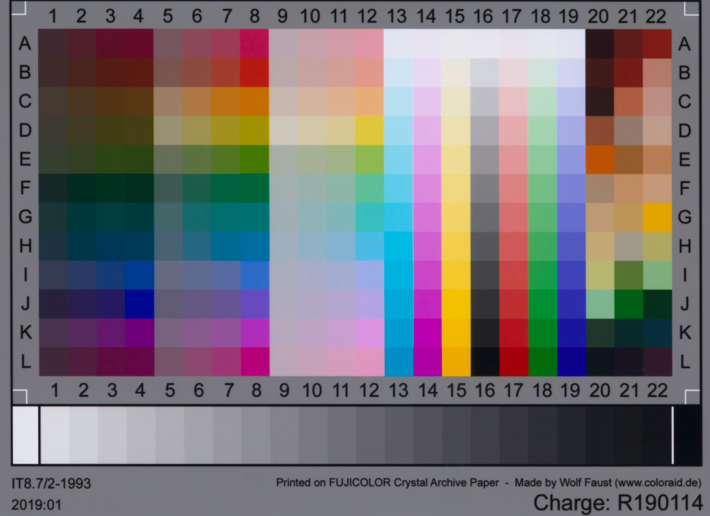
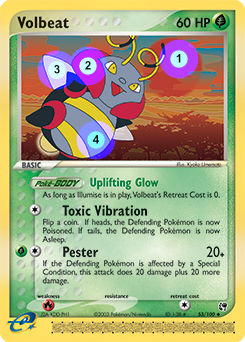
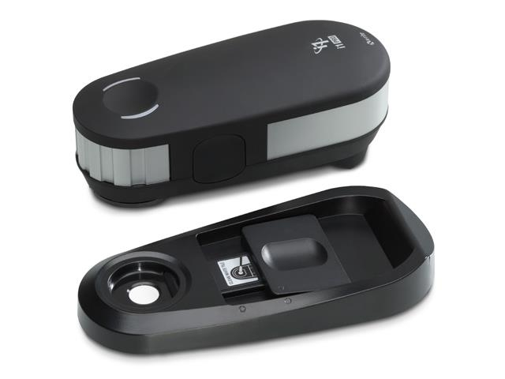
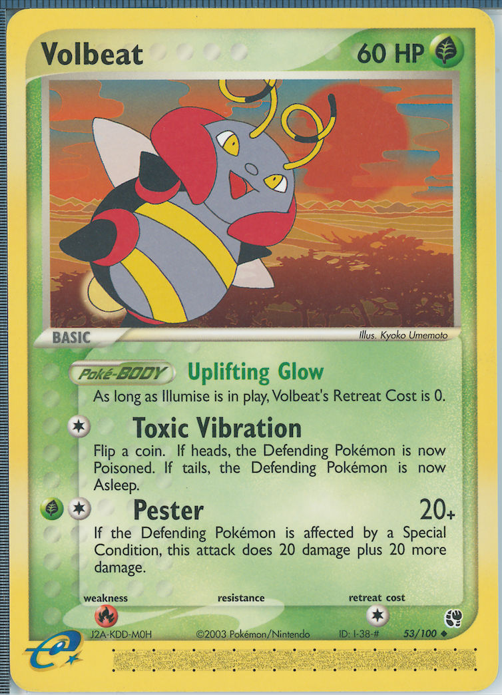
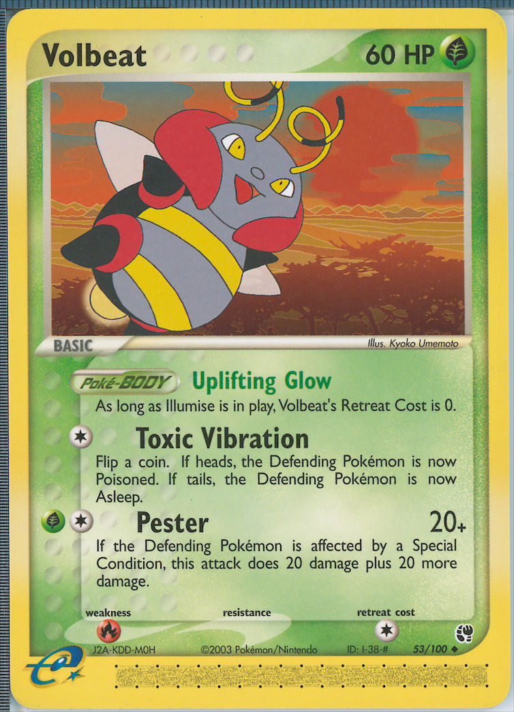

## Introduction

The guidance for doing accurate scans is near-universal: use an [IT8.7/2](https://en.wikipedia.org/wiki/IT8) target to
calibrate your scanner.[^1]



Scan the target "raw"; this means turning off color management in the scanner software, and getting the "earliest" image
possible from the software. Such an image will not have been converted to a working space.

Give some profiling software the scan of the target, from which it can figure out the RGB values of each patch on the
target. These RGB values, combined with manufacturer-provided color measurements of the corresponding physical patches,
allow the profiling software to create an icc profile. The profile, when applied to the image, will tell any software
displaying the image how to interpret the RGB values of each pixel and display the correct colors.

In 2019, I took an interest in scanning Pokémon trading cards to make some nice images that the community could use for
discussion and—in the case of out-of-print cards—printouts for casual play. The existing images for the era of cards I
was interested in were either very small (in the case of the official Pokémon website's images), or poor-quality scans
done in the mid-2000s.[^2] I bought an affordable scanner—the Epson Perfection V550 (now discontinued)—and also bought
an affordable IT8 target from [Wolf Faust](http://www.targets.coloraid.de/). I used Graeme Gill's
[ArgyllCMS](http://argyllcms.com/) as the profile-generation software because it's free and, as it turns out,
tremendously capable. The ArgyllCMS documentation recommends a "matrix+shaper" profile for a "sparse" target like the
IT8/7.2.[^3] So I first ran `scanin` to read the RGB values from the scan of my target. Then I ran

```
% colprof -qm -as -O scanner_profile_qm_as.icc /path/to/scanin_output 
```

And I figured that was the end of it—if I applied this profile to my raw images, they would now have the same colors as
the physical cards themselves!

...Unfortunately, I was wrong. I'd save several months of work for my past self if I were able to go back in time and
tell him the following:

"Because of metameric failure, commercially-available scanner calibration targets cannot be relied on to create
colorimetrically-accurate scans if the media being scanned is different from the media used for the target. The patches
used for profiling should ideally be printed using the same process and paper that was used to print the material being
scanned."

In the rest of this post I'll explain at a high level what this means. Then, in later posts I'll cover:

* a deep dive into why this statement is true, and just how inaccurate various profiles can be (quantifying accuracy
  using CIEDE2000);
* a process that *does* result in verifiably accurate color, along with the many downsides of that process;
* the results of my (currently ongoing) experiments to make that process quickly repeatable on different devices once it
  has been done initially for one scanner and a sample dataset.

I'll also be writing other posts not related to accurate colors. Topics may include:

* my experience scanning cards over the past couple of years, and the articles and tools that I've found to be the most
  helpful
* various post-processing techniques (descreening, downsampling in linear space, noise reduction, unsharp mask
  w/luminosity blend, etc.) and software gotchas
* how to incorporate Doug Gray's [scanner_refl_fix](https://github.com/doug3236/scanner_refl_fix) into a profile
  generation & scanning workflow

## Some background

If you already have a good understanding of how color is measured, CIELAB/CIEXYZ, delta E, and metamers, then feel free
to skip this section.

### Color 101

I highly recommend you pause reading this post and go and first read Richard
Harold's [An Introduction to Appearance Analysis](https://www.color.org/ss84.pdf). (This great writeup is linked on the
ICC website's [article on icc profiles](https://www.color.org/profile.xalter)—that article is also informative, though a
bit dense.)

Here are the main takeaways from that article:

1. Light reflectance can be characterized by an array of values called
   a [spectral power distribution](https://en.wikipedia.org/wiki/Spectral_power_distribution) (SPD). For example, when
   measurements are made with a spectrophotometer, the result is an SPD.[^4]
2. If you define certain lighting & viewing conditions, you can consolidate the many values in an SPD into a single
   tuple (L*,a*,b*). This tuple unambiguously defines the color in a 3d color space called CIELAB. For the printing
   industry and for ICC profiles, those "certain conditions" are standardized: a D50 illuminant + the 1931 CIE 2°
   Standard Observer. (You do not have to know exactly what these conditions mean, just know that there is *some*
   standard.)

### Colorimetric accuracy and delta E

Delta E is an industry-standard metric for quantifying color difference. A great primer on delta E, written by Zachary
Schuessler, can be found [here](http://zschuessler.github.io/DeltaE/learn/). It's a short read; go ahead and check that
out right now if you aren't familiar with this metric.

Quoting directly from Schuessler's post, this is a rough guide to what different delta E ranges mean:

| Delta E | Perception                             |
| :------ | :------------------------------------  |
| <= 1.0  | Not perceptible by human eyes.         |
| 1 - 2   | Perceptible through close observation. |
| 2 - 10  | Perceptible at a glance.               |
| 11 - 49 | Colors are more similar than opposite  |
| 100     | Colors are exact opposite              |

Throughout my posts I'll be using Delta E 2000 (de2k) unless otherwise specified.

We can now define some threshold of colorimetric accuracy using delta E, where the "reference" color is what the color
patch measures in real life using a spectrophotometer, and the sample to compare against is the same patch in my scanned
image. There is no absolute standard on what constitutes an "acceptable" delta E; it would be dependent on use case. If
I just wanted to take some quick picture of a card to make help me make a small point on a forum or blog post, my delta
E needs are probably not as stringent as those of an archivist.

For me, personally, I knew I'd be spending lots of time and effort sorting, scanning, and editing over a thousand cards.
So if I'm putting in all that effort, I might hope for an archival level of accuracy, to make the project worth my time
and to hopefully avoid having to redo any work in the future. So I could arbitrarily shoot for, say, an average delta E
of <1 and a max delta E < 3. Is it even possible to get that close...?

### Metamers & metameric failure

Colors with different SPDs that nevertheless appear the same (i.e. very low delta E between their Lab values) under the
same viewing conditions are called [metamers](https://en.wikipedia.org/wiki/Metamerism_(color)). From Wikipedia:

> The term **illuminant metameric failure** or **illuminant metamerism** is sometimes used to describe situations in which two material samples match when viewed under one light source but not another.

Here is why we care about metamers when it comes to scanning: The scanner shines some light on the object being scanned,
and based on the colors it "sees" reflected back, it encodes various RGB values in the image. We would hope that printed
colors that appear the same in the real world (under D50) would also appear the same under that scanner light, i.e. the
scanner raw file has the same RGB tuple for both of them. Additionally, we would also hope that printed colors that
appear differently in the real world (under D50) have different RGB values once scanned.

### RGB values in images & icc profiles

I've already alluded to this in the introduction, but I'll reiterate here: the RGB pixel values in a given image don't
mean anything without an icc profile to interpret what that color is. You can think of the profile as a translation
function: (some_R, some_G, some_B) to (some_L*, some_a*, some_b*). (You may have worked with images that don't have any
icc profile embedded in them. In those cases, the image viewing software will assume some default profile, which is
almost always the [sRGB](https://en.wikipedia.org/wiki/SRGB) profile.)[^5]

## How do we know that IT8 targets don't work as well as expected?

Finally, we have enough context to answer this question. I claimed at the start of this post that due to metameric
failure, we wouldn't be able to reliably create accurate scans of Pokémon card stock with an IT8 target (which is
photochemically printed on glossy photo paper). Let's now start to prove that claim.

### Introducing profcheck

Let's go back to the example of our Wolf Faust target. Using ArgyllCMS, we are going to create a profile in the
following manner:

```
% ARGYLL_CREATE_WRONG_VON_KRIES_OUTPUT_CLASS_REL_WP=1
% colprof -qh -ax -ua -O profile_using_it8.icc ./scanin_output
% unset ARGYLL_CREATE_WRONG_VON_KRIES_OUTPUT_CLASS_REL_WP
```

I'm not going to explain every part of these strange incantations at this point (that will be in a future post). Just
trust for the time being that this creates a profile that forces the absolute colorimetric rendering intent. This means
that the resulting Lab values of the image match the Lab values of the provided measurement file, i.e. what the
spectrophotometer saw when it measured this target.[^6]

ArgyllCMS provides a useful tool called `profcheck`. profcheck takes as input two files. The first is
a [ti3](https://www.argyllcms.com/doc/ti3_format.html) file that maps RGB values in a raw image to real-life CIELAB (or
CIEXYZ) measurements. So for a 288-patch target, the ti3 file would contain 288 rows that might look something like the
following:

```
<some ti3 metadata here>
# SAMPLE_ID XYZ_X XYZ_Y XYZ_Z RGB_R RGB_G RGB_B STDEV_R STDEV_G STDEV_B
A01 3.460000 2.960000 2.170000 15.48643 10.75012 10.49043 0.146617 0.159456 0.174794 
A02 4.200000 2.880000 1.770000 18.50045 9.026811 9.357642 0.199849 0.147320 0.179902 
A03 5.040000 2.850000 1.440000 21.24687 7.226035 8.438118 0.193290 0.138453 0.166372 
<etc.>
```

Note that this is using [CIEXYZ](https://en.wikipedia.org/wiki/CIE_1931_color_space) measurements instead of CIELAB
ones, but it's easy to convert back-and-forth between the two, and ArgyllCMS can work with either measurement. Also note
that the RGB tuples are normalized to the range [0, 100].

The ti3 file can be quickly generated if you give ArgyllCMS's `scanin` an image file that's laid out in a way it can
recognize, e.g. it knows the layout of the IT8 target, so it can automagically find all 288 of the patches in such an
image, average the RGB values in each patch area, and create a ti3. But there's nothing stopping us from creating a ti3
file manually, so long as we have our own set of real-life measurements along with corresponding scanner RGB values. (
Keep this idea in mind; it will become relevant in the next section.)

The second input to `profcheck` is an icc profile. Since the icc profile is also essentially a map of RGB to CIELAB,
`profcheck` can compare the "real-life" CIELAB to the icc profile's CIELAB "translation." `profcheck`'s output is this
comparison, given as delta E.

We might expect low de2k values if we call `profcheck` on scanin_output and the very scanner profile that was created
from it. And indeed, that's the case:

```
% profcheck -k scanin_output.ti3 profile_using_it8.icc
Profile check complete, errors(CIEDE2000): 
  max. = 1.608338, avg. = 0.496446, RMS = 0.560694
```

This looks like a good result. Overall, the difference between the profile's output and the real-life appearance of the
target (as measured by Wolf Faust's spectrophotometer) isn't perceptible to human eyes. For the patches with highest
delta E, if we're really picky we might be able to tell that those colors are mismatched just a bit. We can use
`profcheck` with the `-v2` argument to list per-patch delta Es, and we can sort by delta E by using the `-s` flag:

```
% profcheck -s -k -v2 scanin_output.ti3 profile_using_it8.icc
[1.608338] GS01: 0.78466810 0.78166620 0.78025420 -> 
  85.436768 -0.776648 -0.873109 should be 
  87.616021 -0.452676 -0.231646
[1.592635] GS03: 0.68268210 0.67100010 0.67086070 -> 
  77.578247 -0.136407 -1.185150 should be 
  79.459906 0.038215 -0.307344
[1.428966] GS00: 0.83596700 0.83926110 0.84877450 -> 
  89.988369 -0.573852 -1.855539 should be 
  92.189509 -0.329659 -1.589465
<282 other rows>
[0.106177] F03: 0.06017311 0.11599920 0.07650831 -> 
  16.484594 -24.761752 7.604675 should be 
  16.601855 -24.654365 7.660090
[0.077862] G04: 0.06373692 0.14131240 0.13396850 -> 
  20.291734 -26.326222 -5.094834 should be 
  20.322086 -26.170230 -5.079342
[0.077231] J03: 0.10419540 0.09699900 0.23630070 -> 
  15.262708 20.484710 -38.129116 should be 
  15.329014 20.633511 -38.253700
```

The tuple to the left of the arrow is an RGB value of the raw scanner image, normalized to a range of 0 to 1. The
numbers to the right of the arrow are two tuples of Lab values. The first is the resulting Lab values after the
profile "translates" the RGB value. The second is the Lab values from a physical measurement of that patch. Ideally,
those two tuples should be "close" together, i.e. we would like the color difference to be small. We're using delta E
2000 to quantify the color difference—that's the number in brackets at the start of each line.

Three grayscale ("GS") patches along the bottom of the target have the highest delta Es: GS01 has the highest
difference, followed by GS03 and then GS00 (which is the white bar at the bottom-right of the target). But even the
largest delta E is 1.61—according to our delta E chart, that's only "perceptible through close observation."

I'd wager that we'd get pretty good color reproduction if we were to scan photos printed on "FUJICOLOR Crystal Archive
DP II Paper," which is what the target is printed on. We'd hit our earlier-stated goal of < 1 average delta E, < 3 max
delta E in this case.

...But will our delta Es be as good if we're scanning something *not* printed on Crystal Archive paper?

### profcheck on Pokémon cards

The catch is that we're scanning trading cards, not photo paper. So we would like to do the same `profcheck` exercise,
only this time with a ti3 file that contains RGB values *from card scans*, and Lab values *from physical cards*.
Unfortunately we don't have a large piece of Pokémon card stock circa 2004 handy with the IT8 chart printed on it (
at least, I don't—if you've got one, let me know :D). If we did, we'd be able to scan it and have `scanin` quickly
determine the RGB values of 288 different color patches.

Since we don't have a target, this means we'll have to go the hard way and create a ti3 file ourselves.

#### Creating a ti3 by hand

We'll look through Pokémon cards of the era we're interested in (for this exercise, those printed in 2003-2006) and pick
out ones that have large-ish regions of constant color on them. Here's an example card, Volbeat EX Sandstorm 53, with
the regions of interest marked and numbered:



We'll try our best to get a variety of colors; on Pokémon cards, it turns out that there's lots of yellow, green, and
blue patches available, and far fewer magenta and cyan. I've noted a few hundred potential different cards that could
work, and I'm actually still in the process of processing the full data set; as of right now I have 203 patches
available. Now for each of the 203 patches we need a real-life CIELAB measurement and a scanner RGB tuple.

Let's tackle getting the CIELAB values first. This will require a spectrophotometer. I'm using the X-Rite i1Pro2:



The i1Pro2 has a measurement aperture with diameter 4.5 mm. This gives us a minimum area for a usable color patch. In
the Volbeat picture above, the inner circles are to-scale with the measurement area of the i1Pro2.

We'll use the i1Pro2 to measure our patches. For Volbeat SS, the CIELAB measurements[^7] of the 4 patches are this:

```
# SAMPLE_LOC LAB_L LAB_A LAB_B
ss053-1 48.24116 42.65866 36.43892
ss053-2 48.04508 55.60760 29.09119
ss053-3 81.65364 4.851535 5.432826
ss053-4 62.32517 -0.0533416 -6.088505
```

Next, we can get RGB values by scanning the card, then opening our scan in [GIMP](https://www.gimp.org/) and using the
eyedropper tool. Given our 4.5 mm-diameter measurement area and a dpi of 1600, it turns out an eyedropper radius of 110
px works well.[^8] For Volbeat SS our scanner RGB values are as follows:

```
# SAMPLE_LOC RGB_R RGB_G RGB_B
ss053-1 35196 17087 12499
ss053-2 38173 14853 14091
ss053-3 49120 46014 43625
ss053-4 32144 32367 34354
```

The scans have 16-bit color channels, so the RGB values are in the range [0, 65535].

To create our ti3 file, for each patch we combine the RGB values (normalized to range [0, 100] to keep ArgyllCMS happy)
and CIELAB values into a single row, and also do the same for the other 199 patches.

```
<some ti3 metadata here>
# SAMPLE_ID SAMPLE_LOC RGB_R RGB_G RGB_B LAB_L LAB_A LAB_B
<10 other rows>
11 "ss053-1" 53.70565 26.07309 19.07225 48.24116 42.65866 36.43892 
12 "ss053-2" 58.24826 22.66423 21.50149 48.04508 55.60760 29.09119 
13 "ss053-3" 74.95232 70.21286 66.56748 81.65364 4.851535 5.432826 
14 "ss053-4" 49.04860 49.38888 52.42084 62.32517 -0.0533416 -6.088505 
<189 other rows>
```

#### Analyzing the Pokémon profcheck results

At long last, we can run:

```
% profcheck -k card-spectro-measurements.ti3 profile_using_it8.icc
Profile check complete, errors(CIEDE2000): 
  max. = 8.265088, avg. = 2.336558, RMS = 2.687289
```

For our Volbeat patches, here are the delta Es (which we can see by calling profcheck with `-v2`):

```
[1.895904] 11 @ ss053-1: 0.53705650 0.26073090 0.19072250 -> 
  48.557180 41.262748 32.198664 should be 
  48.241168 42.658626 36.438933
[1.927984] 12 @ ss053-2: 0.58248260 0.22664230 0.21501490 -> 
  47.845154 54.544742 25.030035 should be 
  48.045080 55.607623 29.091183
[2.474007] 13 @ ss053-3: 0.74952320 0.70212860 0.66567480 -> 
  81.183995 2.841436 5.125732 should be 
  81.653645 4.851528 5.432824
[1.198336] 14 @ ss053-4: 0.49048600 0.49388880 0.52420840 -> 
  63.687846 -0.293576 -6.069309 should be 
  62.325174 -0.053347 -6.088504
```

Let's be very explicit about what these profcheck results mean, using patch ss053-3 as an example. The scanner "sees"
RGB of (0.75, 0.70, 0.67) for that patch (here the RGB values are scaled to [0, 1] and are scanner "raw" RGB values, not
something like an sRGB tuple). Once we apply our profile to the scan, that patch is going to have color (81.18, 2.84,
5.13) in CIELAB. That color is a sort of peach-gray, and it looks like this:


So that's the color that will be in our scan, in the area of the card that I marked "3." And that would probably be
pretty close to that patch's real-life appearance under D50... *if* what the scanner saw came from a
photochemically-printed Crystal Archive DP II Paper.

However, we didn't scan photo paper; we scanned card stock. And we know what that card stock's color *actually* is at
that spot. It's (81.65, 4.85, 5.43) in CIELAB, which is a more reddish color:


The 2.5 delta E measures the difference between what this color is in the digital image vs what it is in real-life. Our
delta E chart says that dE in the 2-10 range is a difference that's "perceptible at a glance."

For our other 202 Pokémon card-sourced patches, some have lower delta E than this one, some higher (the max is dE 8.3!),
with the average delta E being 2.3. So, do we *actually care* about the average delta E being closer to 2.3 than the
original profile's delta E 0.5? For patch ss053-3, the two colors do look similar—it's not as if one looks bright green,
and the other bright red. Are we just being nitpicky? Again, it depends on our goals. Certainly if we just wanted to
create a card image for quick discussion purposes, we don't need to be very picky when it comes to accuracy. However, if
we were hoping to create accurate scans for, say, archival purposes, we might be in for a rude surprise:
seeing that the profile fits its own patches with average delta E of 0.5, we might be lured into thinking that we fit
*all* real-life colors just as well. But for the media that we're actually scanning, we don't have anywhere near that
kind of accuracy!

## Debrief—and where to next?

What we have here is clearly a case of illuminant metameric failure. Under the illuminant of the scanner, a color
printed on photo paper and printed on card stock appear as the same color, e.g. RGB (0.75, 0.70, 0.67). However, under
the D50 illuminant (again, the standard illuminant for the printing industry, as well as the spectrophotometer's
reference) those two colors would appear different—the photo paper's color patch would measure CIELAB (81.18, 2.84,
5.13) and the card stock's patch would measure CIELAB (81.65, 4.85, 5.43).

Hopefully you're now convinced by the statement I made at the beginning of this post: "Because of metameric failure,
commercially-available scanner calibration targets cannot be relied on to create colorimetrically-accurate scans if the
media being scanned is different from the media used for the target."

This idea isn't novel. For instance, it's called out
in [this post](https://www.freelists.org/post/argyllcms/Any-guidelines-for-creating-scanner-profiles-with-Argyll,5),
which was made on the ArgyllCMS mailing list all the way back in 2007. I'll quote the last paragraph in full:

> If you intend to scan media of a very particular type (let's for instance assume that you would like to scan inkjet prints), then it will be IMO even beneficial, if you profile the scanner using a target printed on the SAME media type which you intend to scan (-> same paper, same printer, same inks, same printer driver settings), and not with an IT8 target, which is a significantly different media type (printed chemically on photo paper) and which may likely result in a profile which suffers from metamerism if it is used for scanning the inkjet prints. Also note the potential media WP mismatch between the paper color of the IT8 target and the paper color of the media which you actually want to scan.

### Okay, but *why* is there metameric failure in the first place? What's causing it?

That is an excellent question, and we'll address it later as part of this series!

For advanced readers, here's a very brief summary of the reasons why:

1. [OBAs](https://www.argyllcms.com/doc/FWA.html) are present in both the target paper and the paper of the trading
   cards, but in different amounts, contributing to metameric failure.
2. Different chemistry in the pigments used in offset printing vs photochemical printing contributes to metameric
   failure.
3. Manufacturer-provided target measurements are
   not [M1](https://www.xrite.com/-/media/xrite/files/literature/l7/l7-500_l7-599/l7-510_m_factor_what_does_it_mean/l7-510_m_factor_en.pdf)
   measurements. Using M0 for measuring paper containing OBAs is not recommended, since doing so means that the OBA
   contribution would not be well-defined.[^9]

### Is there some way to actually get the correct color of card stock in the scan?

This is also something we'll cover more in future posts! But I'll leave with this teaser: we can create an icc profile
if we have a ti3 file with scanner RGB values and real-life measurements for the same patches. We already made such a
file, by hand, to use with `profcheck`. What if we also used it to create a profile with `colprof`...?

```
% ARGYLL_CREATE_WRONG_VON_KRIES_OUTPUT_CLASS_REL_WP=1
% colprof -qh -ax -ua -O profile_using_cards.icc ./card-spectro-measurements
% unset ARGYLL_CREATE_WRONG_VON_KRIES_OUTPUT_CLASS_REL_WP
```

```
% profcheck -k ./card-spectro-measurements.ti3 profile_using_cards.icc
Profile check complete, errors(CIEDE2000): 
  max. = 1.844623, avg. = 0.314575, RMS = 0.420020
```

Here's two scans of Volbeat SS. The first has had the "IT8 color profile" applied to it, and the second has had this
"Pokémon card colors profile" applied to it. (Just for this comparison no contrast or levels changes have been made;
normally I *would* do those.)





I think there's an especially notable difference in the yellow color of the border.

-JP

PS: I hope to have my datasets and profiles uploaded to GitHub at a later point. Once they're up, I'll edit them into
this post!

[^1]: See [here](https://www.silverfast.com/PDF/printer_calibration_review_en.pdf), 
    [here](https://scanning.guide/why-calibration-is-important),
    [here](https://www.filmscanner.info/en/Scannerkalibrierung.html),
    and [here](https://www.booksmartstudio.com/color_tutorial/scanners.html) for some examples. Note that I don't wish 
    to put down these guides, but any claims to color accuracy should come with a big asterisk next to them. I do agree
    that an IT8 gives you color *consistency*, although so would something like a "canned" profile that comes with 
    SilverFast. Nevertheless, I would recommend owning a target if you own a scanner; I own 2 IT8 targets, as well as a 
    Hutchcolor target.

[^2]: I do think the folks that made the original images did the best with what they had, and a lot of the equipment and
    software I use for my process now wouldn't have been available in, say, 2005.

[^3]: I realized much later that if you want to make colorimetrically-accurate scans then you do *not* want a
    matrix+shaper profile, but rather a cLUT profile. This is actually 
    [called out](http://www.argyllcms.com/doc/Scenarios.html#PS4) in the doc too... "If the purpose of the input
    profile is to use it as a substitute for a colorimeter, then the -ua flag should be used to force Absolute Colorimetric
    intent, and avoid clipping colors above the test chart white point. Unless the shaper/matrix type profile is a very good
    fit, it is probably advisable to use a LUT type profile in this situation."

[^4]: The spectrophotometer can also return Lab and/or XYZ values for the color, but these are just derived
    mathematically from the SPD.

[^5]: For the Web in particular, this assumption is specified as the standard. A few image viewers (e.g. Discord's
    inline image display) actually ignore any embedded profiles completely and assume sRGB. Naughty, naughty! This behavior
    is notably wrong in the case of iPhone photos, which have the Display P3 profile embedded.

[^6]: It's not an *exact* match, since profile generation tries to create a somewhat smooth profile, versus overfitting
    to the patch data. Note also that this target wasn't actually individually measured; rather, the provided measurements
    are an average of this batch of targets.

[^7]: Measurements are calculated from the averaged SPDs from 3 measurements, measured M1 in spot read mode.

[^8]: GIMP's eyedropper tool samples a square, and we measured a circle, which is a bit awkward. Really the ideal
    sampling area would be a circle with radius 141 px. Also, here's a gotcha/bug for the GIMP eyedropper: it only returns
    the correct RGB values if the working profile is sRGB!

[^9]: It doesn't help if I re-measure the Faust target with the i1Pro2 and use M1 measurements. `profcheck` gives
    `errors(CIEDE2000): max. = 9.445101, avg. = 3.208840` for a profile generated from those measurements, checked against
    the "pokemon colors" ti3.